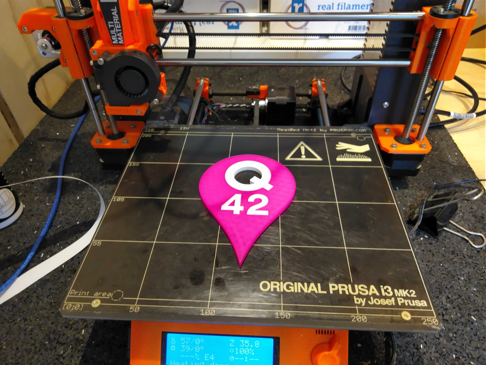

Keychain
========

The keychain is based on the [official logo](https://logo.q42.com/).

Requirements for 3D printing
============================
You will need a 3D printer with multi-color capabilities, like the Prusa Mk2(s) or Mk3(s) and a Multi Material Upgrade, either MMU1 or MMU2(s). Maybe another type of multi-color printer will also work. YMMV.

How to print
------------
 - Load the file [keychain.3mf](keychain.3mf) in [Prusa Slicer](https://www.prusa3d.com/prusaslicer/).
 - Note the object has 5 parts. Each part can be printed in its own color.
 - Make sure you've selected the correct 3D printer. It should probably have 'MMU' in the name and is should not be the one that says 'single'.
 - 
 - Make sure the expert level is set to 'Advanced' or 'Expert'.
 - If you haven't already, this is a good time to load the filaments. Choose the extruder closest to the spool to minimize tangling and filament breaking.
 - OPTIONAL: although not required it helps to set the color of the extruder to the color of the loaded filament. This helps you visualize the outcome.
 - 
 - Now you rightclick on the extruder setting for each part. Select the extruder (1-4) that has the color loaded that you want to use for that part.
 - 
 - Don't forget to select the proper filament setting for each extruder. Note that you probably should different types of filament (like PLA + PETG) unless you really know what your doing.
 - Finally, select the other print settings you want. If you are unsure, good defaults are: 
   - Layer height: 0.2mm
   - Infill: 20%
   - 2 vertical shells
   - 4 top/bottom shells
   - no supports
 - At this point the preview should something like this:
 - 

 
Printing
--------
 - When you're happy with all the settings you can export the gcode and send to the printer to print.
 - WARNING: multi-color printing is a lot more error prone. You really should whatch to make sure the first layer is laid down correctly and frequently check-up on the print. It's quite common to a 'jam' during the print, meaning that the filament gets stuck somewhere. If this happens you should abort the print ASAP and retry. 

